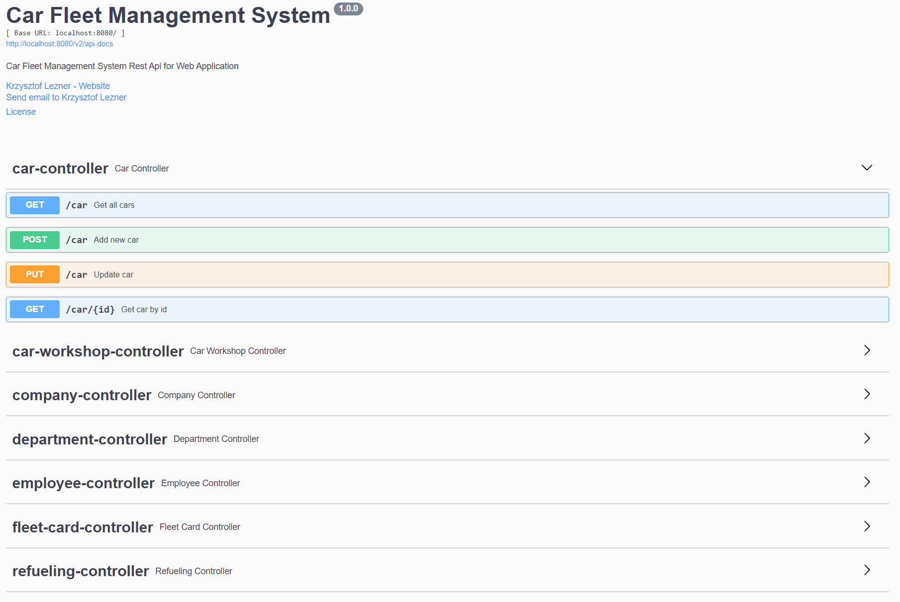

# Company Car Fleet Management System - REST API

System for managing a fleet of cars in the company.

## Table of Contents

* [General Info](#general-information)
* [Technologies Used](#technologies-used)
* [Features](#features)
* [Screenshots](#screenshots)
* [Setup](#setup)
* [Usage](#usage)
* [Project Status](#project-status)
* [Room for Improvement](#room-for-improvement)
* [Acknowledgements](#acknowledgements)
* [Contact](#contact)

<!-- * [License](#license) -->

## General Information

- App in the form of a REST API.
- App can help to manage a fleet of cars in the company.
- App also allows to manage information about company, departments and employees, trips with refuelings and repairs,
  fleet (refueling) cards and car workshops.
- Requests are being called in the form of JSON.
- Response are being received in the form of JSON too.

## Technologies Used

- Java 8
- Maven
- Git
- Spring Boot 2.5.6
- Spring Data JPA
- H2 Database
- Spring Validation
- Spring Security
- REST API
- Swagger UI

## Features

List the ready features here:

- Create, read, update, delete data about:
  - Companies
  - Departments
  - Employees
  - Cars
  - Trips
  - Refuelings
  - Fleet (refueling) cards
  - Repairs
  - Car workshops
- Car trips data reporting
- Car repair data reporting
- Car refuelings data reporting

## Screenshots

## Setup

To try out the app run the following in command line:
> mvn compile

To build the JAR file run the following command:
> mvn package

To execute the JAR file run:
> java -jar target/companycarfleetmanagementsystem-0.0.1-SNAPSHOT.jar`

## Usage

All REST API paths are available on local server running on base url:
`http://localhost:8080/`

Available paths with methods `GET`, `POST`, `PUT`:

`/car`, `/fleetcard`, `/company`, `/department`, `/employee`, `/trip`, `/refueling`, `/repair`, `/carworkshop`

with basic auth credentials:

`U: admin/ P: admin1`

Swagger UI documentation is available here:

`http://localhost:8080/swagger-ui/#/`

## Project Status

> Project is: _in progress_

## Room for Improvement

-

## Contact

Created by [@klezner](https://github.com/klezner) - feel free to contact me!

<!-- Optional -->
<!-- ## License -->
<!-- This project is open source and available under the [... License](). -->

<!-- You don't have to include all sections - just the one's relevant to your project -->
